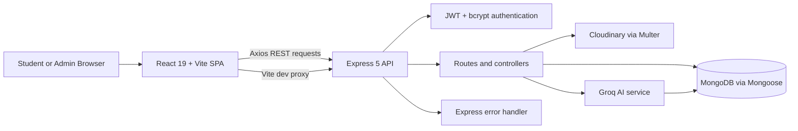

# BMSIT Campus

> An AI-powered campus information and community platform that centralizes announcements, placements, events, student interactions, and campus knowledge through an intelligent assistant.


## Live Demo

- 🌐 **Frontend:** `https://bmsit-campus-platform.onrender.com`
- 🔗 **Backend API:** `https://bmsit-campus-backend.onrender.com`
- 🤖 **Campus AI Assistant:** Included

## Overview

BMSIT Campus is a full-stack campus information and community portal for BMS Institute of Technology and Management. It brings campus announcements, placement and internship updates, events, departments, clubs, IEEE clubs, sports, library information, and student interaction into one searchable feed.

The platform addresses the fragmentation of campus information across separate channels by providing:

- A categorized, media-rich campus post feed.
- Public discovery of departments, clubs, and administrator-authored updates.
- Authenticated interaction through likes, comments, shares, and saved posts.
- Profile management and account deletion.
- A campus-aware AI assistant that searches relevant posts before generating an answer.

## Why This Project?

Campus information is often scattered across messaging groups, notice boards, social channels, and departmental updates. As a result, students can miss important announcements, internship opportunities, placement updates, and events.

BMSIT Campus centralizes these campus-related information streams into one searchable platform. It combines a categorized community feed, role-aware publishing, student interactions, media uploads, and an AI-powered campus assistant that helps users discover relevant knowledge from existing campus posts.

## Project Impact

| Area | Impact |
| --- | --- |
| Problems solved | Reduces fragmented campus communication and makes announcements, placements, internships, events, clubs, and departments easier to discover. |
| Target users | Students, faculty or campus administrators, and other members of the BMSIT community. |
| Key outcomes | A single information hub with searchable content, authenticated engagement, media-rich updates, saved posts, and campus-aware AI assistance. |
| Scalability considerations | Separated React frontend and Express API, MongoDB persistence, Cloudinary media storage, modular routes/controllers/services, and retrieval limited to ranked relevant posts. |

## Resume Highlights

- Full-stack **MERN development** using React, Express, MongoDB, and Node.js.
- JWT authentication and role-based authorization with bcrypt password hashing.
- REST API development across authentication, posts, users, administrators, and AI services.
- MongoDB database design with Mongoose models, references, embedded comments, reactions, tags, categories, and media metadata.
- Cloudinary media management for profile images and post attachments.
- AI-powered campus assistant using the Groq SDK and `qwen/qwen3.8-27b`.
- Retrieval-Augmented Generation (RAG)-style campus retrieval: relevant posts are detected, ranked, and supplied as context before response generation.
- Role-based access control for `Admin` and `User` workflows.

## Features

- JWT-based sign-up, login, current-user lookup, and logout.
- `Admin` and `User` roles.
- Admin-authored posts with category, tags, and up to five media files.
- Image, PDF, and video uploads through Cloudinary.
- Feed and individual post views.
- Categories for General, Placement, Internship, Department, Event, Hackathon, Sports, Club, Library, Announcement, and Achievement.
- Like and share posts; add and save comments; like or dislike comments.
- Save and retrieve posts for the signed-in user.
- Edit and delete posts for admin users.
- Browse departments, clubs, and IEEE clubs.
- Placement news view and event-oriented campus content.
- Admin profile pages with an administrator's posts.
- Edit profile name, username, and profile image.
- Delete the current account.
- Light/dark theme preference persisted in `localStorage`.
- Flash messages for user feedback.
- Markdown-capable AI chat interface with recent conversation history.
- Campus AI retrieval that ranks up to five relevant MongoDB posts by category, tag, and text matches.

## Screenshots

Screenshots are not currently committed to the repository. Add captured images to a `docs/screenshots/` directory and replace these placeholders:

| View | What it demonstrates | Placeholder |
| --- | --- | --- |
| Landing page / campus feed | The central feed for announcements, categorized posts, media, and interactions. | `` |
| Student dashboard | The authenticated student experience, including profile actions, saved posts, and engagement. | `` |
| Faculty or administrator dashboard | Administrator-facing content publishing and authored-post workflows. | `` |
| Admin panel | Admin-controlled post creation, editing, deletion, and categorized campus communication. | `` |
| Event management / event content | Event-related campus posts and event discovery through filters and categories. | `` |
| Placement portal | Placement and internship updates surfaced through the campus feed and placement view. | `` |
| Departments and clubs | Department, club, and IEEE club discovery with administrator profile pages. | `` |
| Campus AI assistant | The conversational assistant that uses relevant campus posts as context for answers. | `` |

## Key Technical Highlights

- **Full-stack JavaScript:** React 19 and Vite on the client; Express 5 and Mongoose on the server.
- **Authentication:** Passwords are hashed with bcrypt and sessions are represented by one-hour JWT bearer tokens.
- **Database integration:** MongoDB stores users, posts, embedded comments, reactions, tags, categories, and media metadata.
- **Media pipeline:** Multer streams profile and post uploads to Cloudinary; uploads support images, PDFs, and common video formats.
- **API development:** REST endpoints are organized by authentication, posts, users, administrators, and AI features.
- **AI retrieval:** The Groq SDK uses `qwen/qwen3.8-27b` with context retrieved from campus posts.
- **Scalable separation of concerns:** Frontend components, backend routes/controllers, Mongoose models, middleware, and services are separated by responsibility.
- **Real-time status:** No WebSocket, Server-Sent Events, or other real-time transport is implemented; feed updates occur through HTTP requests.

## System Architecture



## Tech Stack

| Layer | Technologies |
| --- | --- |
| Frontend | React 19, React DOM, React Router DOM, Vite 7, `@vitejs/plugin-react`, Axios, Bootstrap 5, Lucide React, React Markdown, Remark GFM, React Syntax Highlighter, React Simple Typewriter |
| Backend | Node.js, Express 5, CORS, dotenv |
| Database | MongoDB with Mongoose 8 |
| Authentication | JWT (`jsonwebtoken`), bcryptjs, and configured `express-session` secure cookie middleware |
| Media Storage | Multer, `multer-storage-cloudinary`, and Cloudinary |
| AI | Groq SDK with `qwen/qwen3.8-27b`, plus MongoDB-backed campus context retrieval |

## Project Structure

```text
.
├── Backend/
│   ├── app.js
│   ├── cloudConfig.js
│   ├── middleware.js
│   ├── controllers/
│   │   ├── admin.js
│   │   ├── ai.js
│   │   ├── auth.js
│   │   ├── post.js
│   │   └── user.js
│   ├── models/
│   │   ├── Post.js
│   │   └── User.js
│   ├── routes/
│   │   ├── admin.js
│   │   ├── ai.js
│   │   ├── auth.js
│   │   ├── post.js
│   │   └── user.js
│   ├── services/
│   │   ├── aiService.js
│   │   └── campusAIService.js
│   └── utils/
│       ├── ExpressError.js
│       └── wrapAsync.js
├── frontend/
│   ├── public/
│   ├── src/
│   │   ├── Components/
│   │   │   ├── AIAssistant/
│   │   │   ├── AdminPostPage/
│   │   │   ├── CreatePost/
│   │   │   ├── DisplayPage/
│   │   │   ├── FilterPage/
│   │   │   ├── HomePage/
│   │   │   ├── Layout/
│   │   │   ├── PlacementNews/
│   │   │   ├── Post/
│   │   │   ├── ProfilePage/
│   │   │   └── SignUp/
│   │   ├── Context/
│   │   ├── App.jsx
│   │   └── main.jsx
│   ├── index.html
│   └── vite.config.js
└── .gitignore
```

## Installation & Setup

### Prerequisites

- Node.js 18+ and npm.
- A MongoDB database (local or hosted).
- A Cloudinary account for profile and post media.
- A Groq API key if the AI assistant is enabled.

### Backend

```bash
cd Backend
npm install
node app.js
```

The API listens on `http://localhost:8080` by default. For development, `npx nodemon app.js` can be used because Nodemon is included as a dependency.

### Frontend

```bash
cd frontend
npm install
npm run dev
```

Vite serves the frontend on its standard development port and proxies `/posts`, `/auth`, `/user`, `/admin`, and `/ai` to `http://localhost:8080`.

Production frontend checks:

```bash
npm run lint
npm run build
npm run preview
```

## Configuration

Create `Backend/.env` locally. Do not commit it.

| Variable | Required | Purpose |
| --- | --- | --- |
| `PORT` | No | Backend port; defaults to `8080`. |
| `NODE_ENV` | No | Controls dotenv loading in the backend. |
| `FRONTEND_URL` | Yes in deployment | Allowed frontend origin for CORS. |
| `JWT_SECRET` | Yes | Signs and verifies JWTs and configures the session middleware secret. |
| `MONGO_URL` | Yes | MongoDB connection string. |
| `CLOUD_NAME` | Yes for uploads | Cloudinary cloud name. |
| `CLOUD_API_KEY` | Yes for uploads | Cloudinary API key. |
| `CLOUD_API_SECRET` | Yes for uploads | Cloudinary API secret. |
| `GROQ_API_KEY` | Yes for AI | Groq API key used by the campus assistant. |
| `GROQ_MODEL` | No | Groq chat model; defaults to `qwen/qwen3.8-27b`. |
| `VITE_API_URL` | Yes for deployed frontend | Backend base URL used by Axios in production builds. |

The repository does not include an `.env.example`; create one for your deployment process without adding real credentials.

## API Documentation

All paths below are relative to the backend origin. Protected endpoints require `Authorization: Bearer <JWT>`.

### Authentication

| Method | Endpoint | Auth | Purpose |
| --- | --- | --- | --- |
| `POST` | `/auth/signup` | Public | Create a user with name, username, password, and role. |
| `POST` | `/auth/login` | Public | Validate credentials and return a one-hour JWT. |
| `GET` | `/auth/me` | JWT | Return the current user without the password. |

### Posts and interactions

| Method | Endpoint | Auth | Purpose |
| --- | --- | --- | --- |
| `GET` | `/posts` | Public | List posts newest first. |
| `POST` | `/posts` | Admin | Create a categorized post with up to five media files. |
| `GET` | `/posts/:id` | Public | Return one post. |
| `PUT` | `/posts/:id` | Admin | Update post text, category, tags, and optional media. |
| `DELETE` | `/posts/:id` | Admin | Delete a post. |
| `POST` | `/posts/:id/like` | JWT | Toggle a post like. |
| `POST` | `/posts/:id/comment` | JWT | Add a comment. |
| `POST` | `/posts/:id/share` | JWT | Record a share. |
| `POST` | `/posts/:id/save` | JWT | Toggle a saved post. |
| `POST` | `/posts/:postId/comments/:commentId/like` | JWT | Toggle a comment like. |
| `POST` | `/posts/:postId/comments/:commentId/dislike` | JWT | Toggle a comment dislike. |
| `GET` | `/posts/saved/me` | JWT | List the current user's saved posts. |

### Users, administrators, and AI

| Method | Endpoint | Auth | Purpose |
| --- | --- | --- | --- |
| `PUT` | `/user/profile` | JWT | Update name, username, and optional profile image. |
| `DELETE` | `/user/account` | JWT | Delete the current account and clean up related references. |
| `GET` | `/admin/posts/:name` | Public | Return an administrator profile and authored posts. |
| `POST` | `/ai/chat` | Public | Generate a campus-aware AI response from a message and optional history. |
| `GET` | `/` | Public | Health-style response: `BMSIT Campus Backend Running`. |

## Database Schema

MongoDB contains two Mongoose models:

### `User`

| Field | Description |
| --- | --- |
| `role` | `Admin` or `User`; defaults to `User`. |
| `name` | Display name. |
| `username` | Login and profile identifier. |
| `password` | bcrypt hash; excluded from authenticated user responses. |
| `profile_image` | Cloudinary filename and URL metadata. |

### `Post`

| Field | Description |
| --- | --- |
| `author` | Required reference to `User`. |
| `text` | Required post body. |
| `category` | Enumerated campus category. |
| `tags` | String array used by feed and AI search. |
| `media` | Uploaded filename, content type, and URL metadata. |
| `likes`, `saves`, `shares` | Arrays of `User` references. |
| `comments` | Embedded comments with author reference, text, timestamps, likes, and dislikes. |
| `adminName`, `username`, `adminProfileImage` | Optional denormalized author display fields. |
| `createdAt`, `updatedAt` | Mongoose timestamps. |

Deleting an admin removes their authored posts. Deleting any user removes that user's comments and reaction references from posts.

## User Roles & Permissions

| Role | Permissions |
| --- | --- |
| `User` | Browse content; authenticate; like, comment, share, and save posts; manage their profile; delete their account; use the AI assistant. |
| `Admin` | All user capabilities plus create, edit, and delete posts. Admin profile pages expose their posts. |

Role checks are enforced on post mutations with the backend `isAdmin` middleware. Signup currently accepts the submitted role value, so production deployments should restrict or administratively provision `Admin` accounts.

## Usage Guide

1. Register at `/signup` and sign in at `/login`.
2. Explore the home feed, display page, placement news, departments, clubs, and IEEE clubs.
3. Open a post to read comments and use the like, comment, share, or save actions.
4. Open the profile area to edit profile data, view saved posts, or delete the account.
5. Administrators can create categorized posts with tags and media, then edit or delete their post content through the admin UI.
6. Open the AI assistant and ask about campus topics; the backend searches matching campus posts and supplies the results as context to Groq.

## Deployment

No Dockerfile, CI workflow, hosting manifest, or provider-specific deployment configuration is included in the repository. Deploy the two applications separately:

1. Provision MongoDB and Cloudinary.
2. Deploy the `Backend/` directory to a Node-compatible host.
3. Set all backend variables, including a strong `JWT_SECRET`, `MONGO_URL`, Cloudinary credentials, `GROQ_API_KEY`, and the deployed `FRONTEND_URL`.
4. Start the backend with `node app.js` and expose its HTTPS URL.
5. Build the frontend with `npm run build` from `frontend/`.
6. Set `VITE_API_URL` to the public backend URL and serve `frontend/dist` from a static host.
7. Configure the frontend host to fall back to `index.html` for React Router routes.
8. Confirm CORS, secure cookies, media uploads, MongoDB connectivity, and AI requests in the deployed environment.

## Security Considerations

- Passwords are hashed with bcrypt and are not returned by `/auth/me`.
- Protected operations verify JWT signatures and expiration.
- Admin-only post mutations require the `Admin` role.
- CORS is restricted to `FRONTEND_URL` and credentials are enabled.
- Authentication data is kept in browser `localStorage`; protect deployments with HTTPS and consider an HttpOnly refresh-token strategy for stronger XSS resilience.
- Keep MongoDB, Cloudinary, Groq, and JWT secrets outside source control.
- Validate and sanitize rich text/media content further before exposing the application publicly.
- Restrict public role assignment during signup; the current implementation allows the submitted `Admin` value.
- Add rate limiting, request-size limits, security headers, audit logging, and automated dependency updates before production use.

## Future Enhancements

These are recommended improvements based on the current implementation:

- Add a backend `start`/`dev` script, automated tests, and an `.env.example`.
- Add CI for frontend lint/build and backend API tests.
- Add pagination, indexes, and full-text search for large post collections.
- Move tokens to a secure cookie-based refresh-token flow and add server-side logout/revocation.
- Add moderation, reporting, validation, and audit trails for posts and comments.
- Add explicit ownership checks for post edits/deletes and protect administrator profile APIs as appropriate.
- Add real-time notifications for new announcements and interactions.
- Add monitoring, structured logging, backups, and a documented hosting configuration.

## Contributing

1. Create a feature branch.
2. Keep frontend and backend changes scoped to the relevant layer.
3. Do not commit `.env` files or credentials.
4. Run `npm run lint` and `npm run build` in `frontend/`.
5. Document API or schema changes in this README and open a pull request with a clear description.

## License

This project is licensed under the MIT License. See the [LICENSE](LICENSE) file for details.
